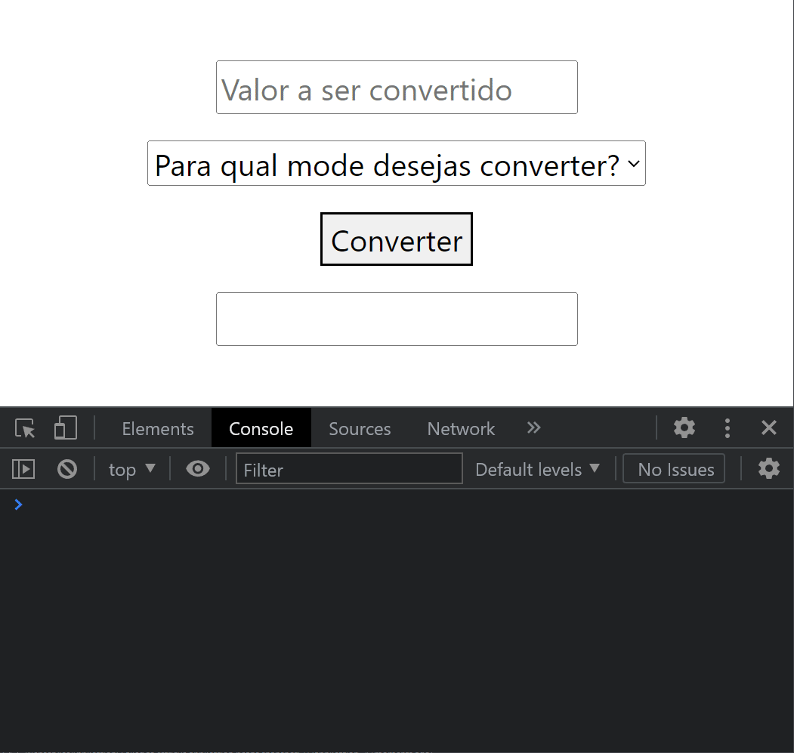

# Exemplo de projeto utilizando-se do padrão WebService.



Com o intuito de dois softwares distintos se comunicarem através da internet, primordialmente pelo protocolo HTTP, se
foi desenvolvido uma entidade consumidora, e uma entidade provedora.

### A entidade consumidora é um simples HTML com JavaScript que coleta os dados de input do usuário e utiliza-se da API Fetch do JS para realizar uma requisição á API Rest com Spring que é a entidade provedora.

```javascript
    window.onload = () => {
    document.getElementById("formConverter").addEventListener("submit", (event) => {
        event.preventDefault();

        fetch("http://127.0.0.1:8080/converter", {
            method: "POST",
            body: new URLSearchParams(new FormData(event.target)),
        }).then((resp) => {
            return resp.json();
        }).then((body) => {
            document.getElementById("resultado").value = body.valorConvertido;
        }).catch((error) => {
            console.log(error);
        });
    });
};
```

### A entidade provedora é um simples endpoint que utiliza-se do padrão controller nativo do Spring, que receberá no corpo da requisição os valores de input inseridos no consumidor, que são o valor em real, e a moeda destino a ser convertida.

```java

@RestController
@CrossOrigin
public class ConversaoController {

    private static HashMap<String, Double> valoresConversao = new HashMap<>();

    static {
        valoresConversao.put("USD", 5.43);
        valoresConversao.put("EUR", 3.46);
    }

    @RequestMapping(
            path = "/converter",
            method = RequestMethod.POST,
            consumes = MediaType.APPLICATION_FORM_URLENCODED_VALUE,
            produces = {
                    MediaType.APPLICATION_ATOM_XML_VALUE,
                    MediaType.APPLICATION_JSON_VALUE,
                    MediaType.TEXT_PLAIN_VALUE
            })
    public ResponseEntity<Object> converter(ConversaoDTO conversaoDTO) {
        ObjectMapper objectMapper = new ObjectMapper();
        double valorConvertido = valoresConversao.get(conversaoDTO.getMoeda()) * conversaoDTO.getValor();
        conversaoDTO.setValorConvertido(valorConvertido);
        try {
            return new ResponseEntity<>(objectMapper.writeValueAsString(conversaoDTO), HttpStatus.OK);
        } catch (JsonProcessingException jsonPE) {
            return new ResponseEntity<>("Erro!", HttpStatus.INTERNAL_SERVER_ERROR);
        }
    }

}
```